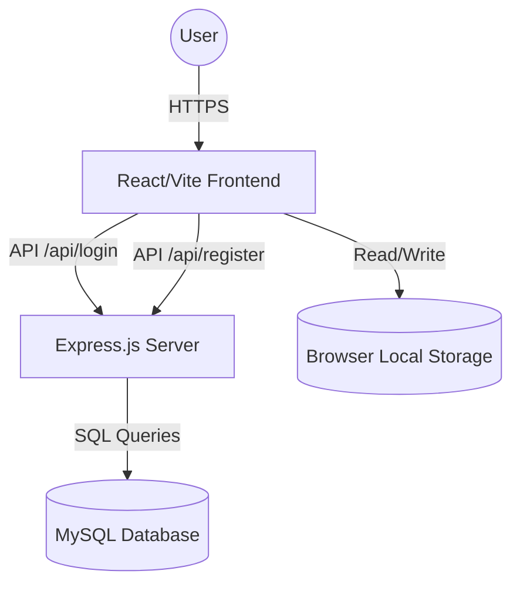

# Project Report: Suraksha - Women Safety & Empowerment Platform

## 1. Executive Summary
Suraksha is a comprehensive digital platform dedicated to women's safety and empowerment. It blends reactive emergency tools (SOS, Guardian Network, AI Threat Detection) with proactive community resources (job portals, self-defense tutorials, and legal rights education).

## 2. Technical Architecture

### 2.1 Technology Stack (Languages & Frameworks)
- **Frontend / Website:**
  - **Core:** React 19, TypeScript (TSX), DOM manipulation.
  - **Styling:** Tailwind CSS, Radix UI primitives, Lucide React icons, Framer Motion/GSAP animations.
  - **Build Tool:** Vite.
- **Backend / Server:**
  - **Core Environment:** Node.js.
  - **Framework:** Express.js.
  - **Languages:** JavaScript.
- **Database & Data Storage:**
  - **Primary Relational DB:** MySQL (`suraksha_db`). Used for secure user authentication, registration, and role management.
  - **Client-Side Storage:** Browser `localStorage`. Used for rapid prototyping and caching of Forum Posts, Video Incident Reports, and User Settings (Language, Theme, Location).

### 2.2 System Overview

### 2.3 Key Modules
- **Safety Dashboard:** Real-time SOS triggering and connection to the "Guardian Network".
- **Community Forum & Reporting:** Anonymous incident reporting and peer-to-peer discussions.
- **Educational Hub:** Modules on cyber security, self-defense (videos), and legal rights.
- **Job Resources:** Direct links to government schemes (NCS, Skill India).
- **Settings & Accessibility:** Multilingual support (English/Hindi) and "Dark Mode" UI.

## 3. Data Flow & Security
- **Authentication:** Users register and log in via the Node.js backend. Passwords are cryptographically hashed using `bcrypt` before being stored in MySQL.
- **Frontend State:** `React Context` combined with custom hooks (`useLocalStorage`) seamlessly syncs UI preferences without requiring constant database roundtrips.

## 4. Future Roadmap
- **Live GPS Tracking:** Integrating WebSockets to send live location updates to emergency contacts.
- **AI-Powered Incident Verification:** Using machine learning to parse uploaded video reports and auto-flag critical threats to authorities.
- **Mobile Application:** Porting the React web application to React Native for native Android and iOS experiences.
